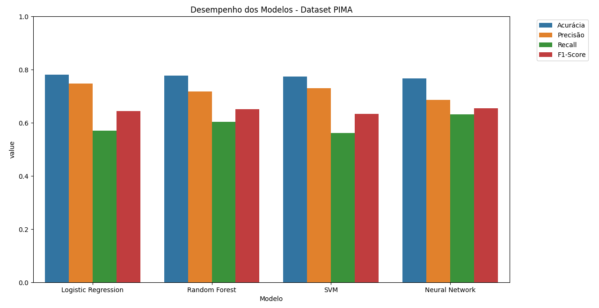
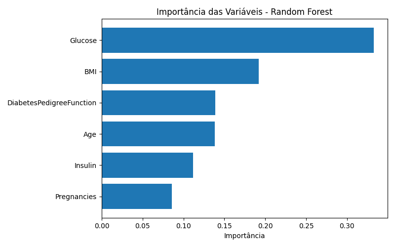
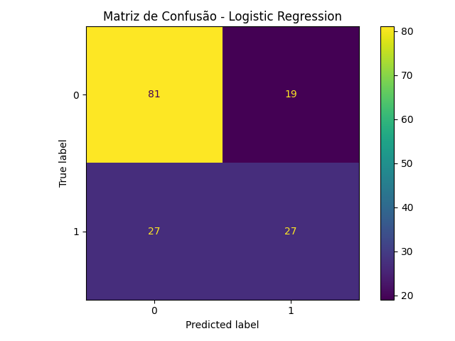
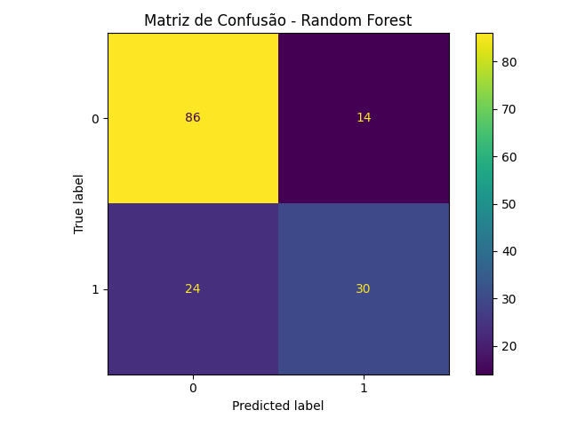

# Predição de Diabetes mellitus utilizando Modelos de Aprendizado de Máquina

Este projeto investiga o uso de algoritmos de aprendizado de máquina para prever o risco de diabetes com base em dados clínicos e populacionais. O trabalho foi desenvolvido por estudantes dos departamentos de **Estatística (DEs)** e **Computação (DC)** da **Universidade Federal de São Carlos (UFSCar)**.

O diagnóstico precoce é essencial para evitar complicações graves, como doenças cardiovasculares e insuficiência renal. Este estudo utiliza técnicas de aprendizado de máquina (ML) para identificar padrões em variáveis como glicose, IMC e idade, oferecendo uma ferramenta de triagem acessível.

---

## 📊 Visão Geral dos Datasets

O estudo avalia a robustez dos modelos em dois cenários distintos:

- **Indian Pima Diabetes Dataset**: Contém 768 registros de pacientes com 8 variáveis clínicas, focado em prever a ocorrência de diabetes com base em dados laboratoriais.
- **Vigitel (2023)**: Extraído do sistema de vigilância do Ministério da Saúde do Brasil, contém 21.690 registros com foco em fatores de risco populacionais.

---

## ⚙️ Metodologia Experimental

A pipeline foi estruturada para garantir o rigor estatístico e a replicabilidade dos resultados:

### 1. Pré-processamento e Limpeza

- **Tratamento de Dados (Pima)**: No dataset Pima, valores `0` em variáveis como Insulina foram tratados como dados faltantes e imputados via **mediana**, garantindo robustez contra *outliers*.
- **Tratamento de Dados (Vigitel)**: Valores ausentes foram preenchidos com a média das colunas.
- **Normalização**: Aplicação de `StandardScaler` para garantir que modelos baseados em distância (SVM) e gradiente (Redes Neurais) não fossem enviesados pela escala das variáveis.

### 2. Divisão e Treinamento

- **Divisão Estratificada**: 80% para treino e 20% para teste.
- **Otimização**: Uso do `RandomizedSearchCV` para ajuste de hiperparâmetros.

---

## 🧠 Modelos Avaliados

1. **Regressão Logística**  
2. **Random Forest**  
3. **SVM (Support Vector Machine)**  
4. **Rede Neural (MLP)**  

---

## 📈 Análise Técnica de Resultados

### Comparativo de Métricas (Dataset Pima)



*Comparativo de Acurácia, Precisão, Recall e F1-Score.*

---

### Importância das Variáveis



*Glicose e IMC consolidam-se como os principais preditores estatísticos.*

---

### Matrizes de Confusão

| **Logistic Regression** | **Random Forest** |
| :---: | :---: |
|  |  |
| **SVM** | **Neural Network** |
|  |  |

---

### Resumo dos Resultados

- **Indian Pima**: O **Random Forest** apresentou o melhor **Recall** após o ajuste de hiperparâmetros, sendo o modelo mais seguro para triagem (minimização de falsos negativos).  
- **Vigitel**: A alta acurácia da Regressão Logística esconde um desafio de **desbalanceamento de classes**, onde o modelo tende a favorecer a classe majoritária.
- **Geral**: Modelos não-lineares como Random Forest mostraram maior **resiliência** a amostras reduzidas e dados ruidosos.

---

## 🚀 Como Executar

1. Instale as dependências:

```bash
pip install -r requirements.txt
